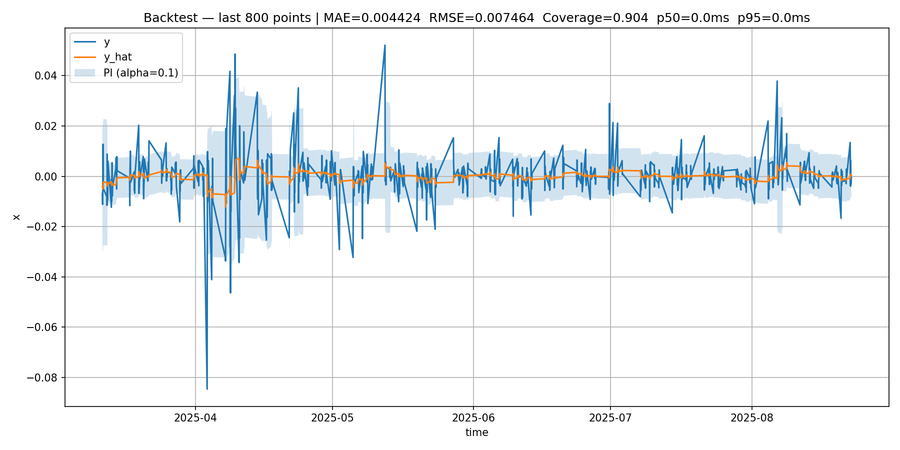
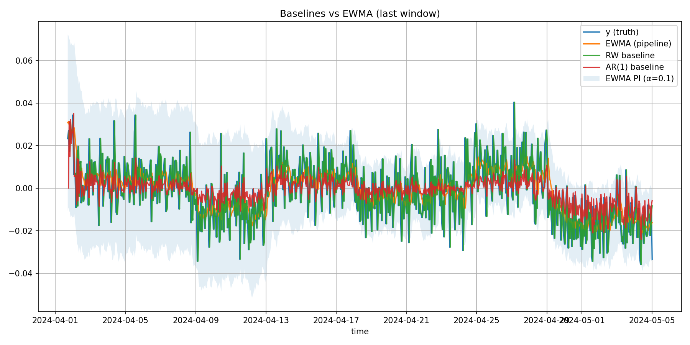

# Regime Forecast Lite

Minimal streaming forecaster with a leakage-safe pipeline and optional FastAPI service.

* **Model:** online EWMA, next-tick forecast
* **Change-points:** BOCPD (Student-t) with cooldown/hysteresis
* **Uncertainty:** online conformal (sliding window, optional decay, per-regime buffers)
* **Service:** FastAPI with `/predict → /truth` flow, Prometheus metrics
* **Backtesting:** CLI runner with coverage / latency / change-point metrics and plotting

## What & Why

This project tracks short-horizon dynamics in a univariate stream (e.g., log returns), detecting regime shifts and producing calibrated prediction intervals online. It’s built to show an end-to-end loop: ingest → forecast → emit uncertainty → learn from truth → serve + monitor.

## Status & requirements

* **Python:** 3.11 (also tests on 3.12 if you care; Docker image uses 3.11).
* **OS:** Linux/macOS.
* **GPU:** not needed.
* **State model:** in-memory per `series_id`. Multiple workers = independent states (read: don’t expect shared buffers unless you add persistence).

## Install

Library-only:

```bash
pip install -e .
```

With extras used in this README:

```bash
pip install -e ".[service,backtest,plot,market,dev]"
```

## Quickstart (demo)

```bash
python3 -m venv .venv
. .venv/bin/activate
python -m pip install -U pip
pip install -e ".[service,backtest,plot,market,dev]"
chmod +x scripts/readme_run.sh
./scripts/readme_run.sh
```

Artifacts:

* Backtest plot: `artifacts/plot_sim.png` (last 800 points)
* Synthetic data: `data/sim.csv`

### Example metrics (synthetic; EWMA + BOCPD; α=0.10)

```
MAE=0.021  RMSE=0.031  Coverage=0.91
Latency: p50≈1.2 ms, p95≈1.4 ms  (single-process, on x86_64; pure CPU; includes JSON encode/decode)
CP: precision=1.00, recall≈0.04, tardy≈2 ticks (avg)
```

Numbers vary run-to-run. Hardware and window sizes matter—see “Metrics & definitions”.

## Real-market example (AAPL, 1h)

```bash
export MPLBACKEND=Agg
python -m data.yahoo_fetch --ticker AAPL --interval 1h --start 2023-01-01 --out data/aapl_1h_logret.csv

python scripts/plot_backtest.py \
  --data data/aapl_1h_logret.csv \
  --profile market \
  --alpha 0.1 \
  --cp_tol 10 \
  --last 800 \
  --out artifacts/plot_aapl.png
```

Generated plot (last 800 points):



Notes:

* If Yahoo returns an empty frame for `1h`, try a shorter date range or `--interval 1d`.
* `--profile market` uses `config/market.yaml`.
* Backtester expects column `x` = log returns (the fetcher computes it).

## Data schema (backtester)

* `timestamp` (ISO8601, UTC recommended)
* `x` (float): target value per tick (e.g., log return)
* Optional covariates if you wire them: any numeric columns (ignored by EWMA baseline)

Timestamps must be strictly increasing per series. NaNs are dropped; leading/trailing NaNs trigger warmup mode.

## Run the service

Dev:

```bash
uvicorn service.app:app --reload --host 0.0.0.0 --port 8000
```

Health & metrics:

```bash
curl -fsS localhost:8000/healthz
curl -fsS localhost:8000/metrics
```

Interactive docs: open `http://localhost:8000/docs`.

### `/predict → /truth` flow

**POST /predict** — one observation in, one forecast+interval out.

Request:

```json
{
  "timestamp": "2024-01-01T00:00:00Z",
  "x": 0.0023,
  "covariates": {"rv": 0.01, "ewm_vol": 0.012, "ac1": 0.1, "z": -0.2},
  "series_id": "default",
  "target_timestamp": "2024-01-01T01:00:00Z"
}
```

Response:

```json
{
  "prediction_id": "UUID",
  "series_id": "default",
  "target_timestamp": "2024-01-01T01:00:00Z",
  "y_hat": 0.0018,
  "intervals": {"alpha=0.10": [-0.012, 0.016]},
  "interval_low": -0.012,
  "interval_high": 0.016,
  "regime": "low_vol",
  "score": 0.13,
  "latency_ms": {"service_ms": 1.2},
  "warmup": false,
  "degraded": false
}
```

**POST /truth** — attach the realized value to update buffers.

```json
{ "prediction_id": "same-UUID", "y": 0.0031 }
```

Idempotent by `prediction_id`. Updates conformal buffers online.

Field notes:

* `warmup`: intervals not yet calibrated (insufficient window).
* `degraded`: using fallback behavior (e.g., empty buffers or missing covariates).
* `score`: detector’s regime score for the returned state (0–1).

## Baselines (EWMA vs RW vs AR(1))

You shouldn’t trust a single model in isolation. Compare EWMA against trivial alternatives on the **same window/mask**:

* **RW (naive):** `ŷ_t = x_{t-1}`
* **AR(1) online:** recursive OLS/forgetting, `ŷ_t = φ_{t-1} x_{t-1}`
* **EWMA (this project):** pipeline’s online EMA forecast

**Command used for the plot and metrics (AAPL, 1h; last 800 points; α=0.1):**

```bash
python scripts/plot_baselines.py \
  --data data/aapl_1h_logret.csv \
  --profile market \
  --alpha 0.1 \
  --cp_tol 10 \
  --last 800 \
  --out artifacts/plot_aapl_baselines.png
```

**Plot (last 800 points):**



**Metrics from the run above:**

```json
{
  "out": "artifacts/plot_aapl_baselines.png",
  "n_points_plotted": 800,
  "metrics": {
    "ewma": { "mae": 0.0086602500725113, "rmse": 0.010903265183817849, "coverage": 0.9375, "mean_width": 0.04734823904420351 },
    "rw":   { "mae": 0.011150869505359878, "rmse": 0.014050799942566049, "coverage": 0.8923654568210263, "mean_width": 0.04550806686136935 },
    "ar1":  { "mae": 0.009391868130377571, "rmse": 0.011864766799166357, "coverage": 0.8973717146433041, "mean_width": 0.038606637435060626 }
  }
}
```

**Takeaway:** On AAPL-1h (last 800), **EWMA** has the best MAE/RMSE and achieves higher empirical coverage than RW and AR(1), **at the cost of wider intervals**. **AR(1)** produces tighter intervals but **under-covers**, especially after regime changes. **RW** is worst on point error and also under-covers.

## Metrics & definitions (be explicit)

**Coverage (conformal).** For target level `1−α`, empirical coverage is the fraction of `y_t` falling within `[L_t(α), U_t(α)]`. With sliding window `W`, report both overall and last-`W`.

* **Target:** close to `1−α` on i.i.d. residuals; expect dips around regime changes.
* **By-regime:** if `by_regime=true`, compute coverage per current regime (more volatile but more honest).

**Latency.** Measure at the service boundary, not just model compute.

* **Definition:** time from request received to response sent (`service_ms`).
* **Report:** p50 and p95.
* **Include:** parsing, model update, interval compute, serialization.
* **Exclude:** network transit unless you’re measuring over HTTP from a client.

**Change-point (CP) metrics.** Let `C = {c_i}` be ground-truth CP indices and `Ċ = {ĉ_j}` the detector outputs. With tolerance `τ=cp_tol`:

* **True positive:** an output `ĉ_j` that matches any `c_i` with `|ĉ_j − c_i| ≤ τ`, unmatched `c_i` then removed from consideration to avoid double-credit.
* **Precision:** TP / detected (`|Ċ|`).
* **Recall:** TP / truths (`|C|`).
* **Tardiness:** for matched pairs, mean `(ĉ_j − c_i)` clipped below at 0; report “ticks late” on average.

Spell this out because every paper/tool does it differently.

## Backtesting

One-shot:

```bash
python -m backtest.cli --data data/sim.csv --alpha 0.1 --cp_tol 10 --data data/sim.csv --alpha 0.1 --cp_tol 10
```

Plot last window:

```bash
python scripts/plot_backtest.py --data data/sim.csv --alpha 0.1 --cp_tol 10 --last 800 --out artifacts/plot_sim.png
```

Parameter sweep (parallel):

```bash
python scripts/exp_sweep.py --data data/sim.csv --alpha 0.1 --jobs 4 --smoke 20 --out sweep.jsonl
```

## Configuration

Resolution order:

1. `--config` path
2. `$REGIME_CONFIG`
3. Profile: `--profile` or `$REGIME_PROFILE` → `config/profiles/<profile>.yaml`
4. Fallback: `config/default.yaml`

Key knobs you actually care about:

```yaml
features:   { win: 50, rv_win: 50, ewm_alpha: 0.1 }
detector:   { threshold: 0.6, cooldown: 5, hazard: 0.005, rmax: 400, vol_threshold: 0.02 }
model_alpha: 0.2          # EWMA smoothing
conformal:  { window: 500, decay: 1.0, by_regime: false, cold_scale: 0.01, alpha_main: 0.1, alphas: [0.1] }
```

* `hazard`/`rmax`: BOCPD prior over run length / cap.
* `cooldown`: suppress repeat alarms for N ticks after a CP.
* `alpha_main`: target miscoverage (e.g., 0.10 → 90% intervals).
* `decay`: optional exponential down-weighting for non-stationarity.
* `cold_scale`: widen intervals during warmup.

## Docker (short version)

Lean image:

```bash
make docker-build
docker run --rm -p 8000:8000 regime-forecast-lite:latest
```

Dev image (extras installed):

```bash
make docker-build-dev
make docker-run-dev
```

**Workers/state:** default to 1 worker. With >1, each worker holds its own buffers; predictions diverge.

## Limitations

* EWMA lags abrupt shifts (by design).
* Conformal assumes exchangeable residuals; coverage dips around CPs.
* Yahoo data can be incomplete/throttled.
* Service state is in-memory; restart wipes buffers unless you persist them.

## Project structure

```
backtest/   # CLI + metrics + runner
core/       # pipeline, features, BOCPD, conformal, config loader
data/       # CSV/Parquet replay, synthetic generator, Yahoo fetch
models/     # EWMA online model
service/    # FastAPI app + Pydantic schemas
scripts/    # CI checks, plotting, demo runner, sweeps
tests/      # unit tests (features, conformal, BOCPD) + service smoke test
```

## Develop

```bash
ruff check . && ruff check . --fix && ruff format .
mypy .
pytest -q
./scripts/ci_checks.sh
```

## License

MIT (see `LICENSE`).

## Acknowledgements

* BOCPD: Adams & MacKay (2007)
* Conformal prediction on absolute residuals

---

